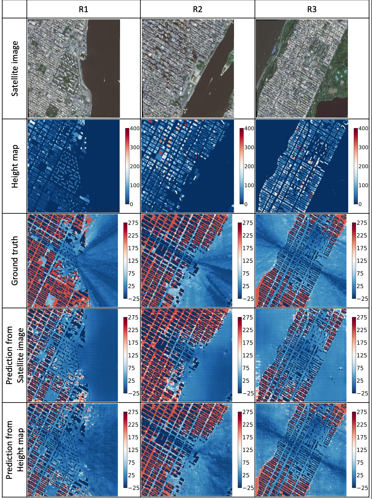

# PL-GAN 

This is a github repository for the Path Loss GAN (PL-GAN) project. PL-GAN infers excess path loss of an area from a satellite or height map image. The paper is currently under review.  

Running the evaluation code infer.py will generate the path loss images and the statistical comparison between height map input and satellite image input.

The test set can be downloaded from this [drive](https://drive.google.com/drive/folders/1DgGqWcX1VYvIf8YDjjmr6WHAO1bJBvUN?usp=sharing). 
Place it in the test folder and run infer.py.

The figure below shows input images and results for some sample regions.

